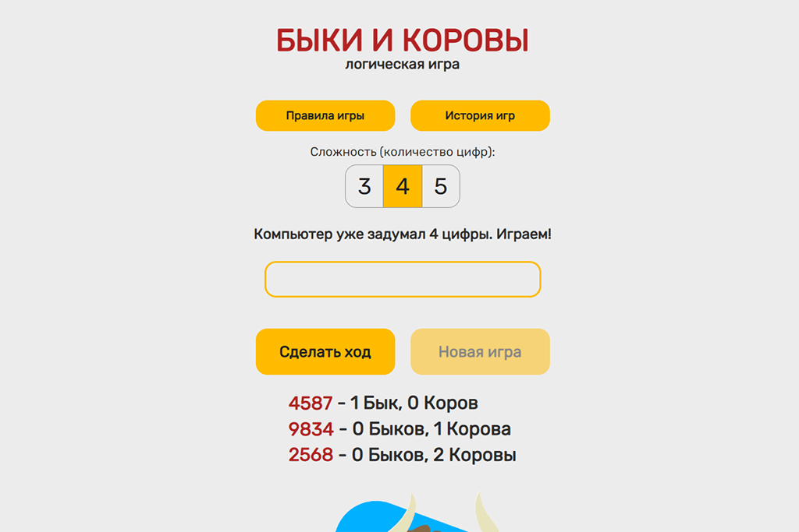

<h1 align="center">
Bulls and Cows (backend)
</h1>

<h3>This web application is deployed on "Glitch" and uses the frontend deployed on "Github Pages"</h3>

  **Github (frontend):**  https://github.com/repti85/bulls-and-cows.git 
  

https://repti85.github.io/bulls-and-cows/

## Implementation:
The application sends a request to the API of the Central Bank of the Russian Federation for the required date and the previous one and receives data in xml format, which it processes and converts into an array with objects, including:
- letter code,
- amount,
- Name,
- price on the requested date,
- previous date price

## Features:
**Language: JavaScript**

**Modules used: ExpressJS, Needle, Cors, XML-JS**
