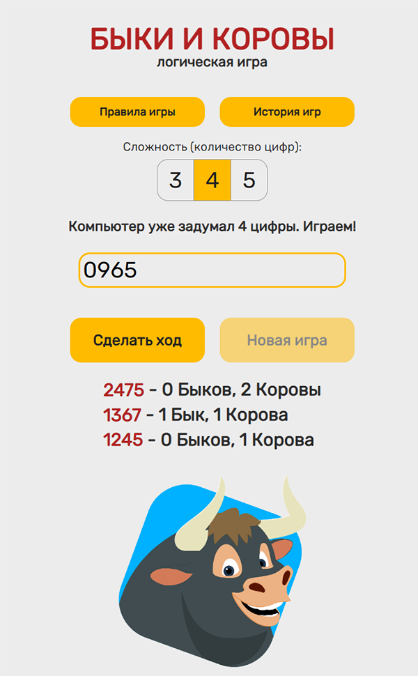
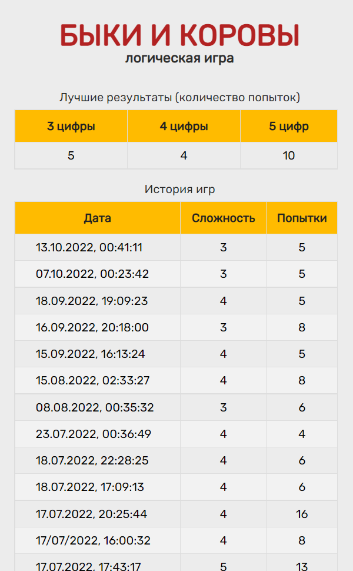

<h1 align="center">
Bulls and Cows (backend)
</h1>

<h3>This web application is deployed on "Glitch" and uses the frontend deployed on "Github Pages"</h3>

  **Github (frontend):**  https://github.com/repti58/bulls-and-cows.git 
  

 

https://repti58.github.io/bulls-and-cows/

## Implementation:
This application is used to interact with the SQLite3 database, which stores the history of games and to calculate the best scores for each level of difficulty of the game.

## Features:
- **Technologies used: NodeJS, ExpressJS, SQLite3 DB**
